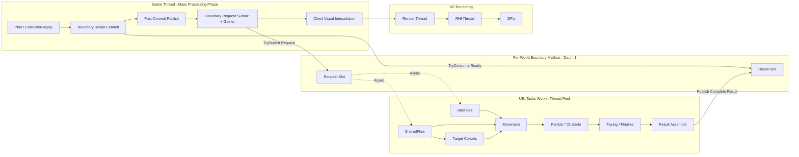
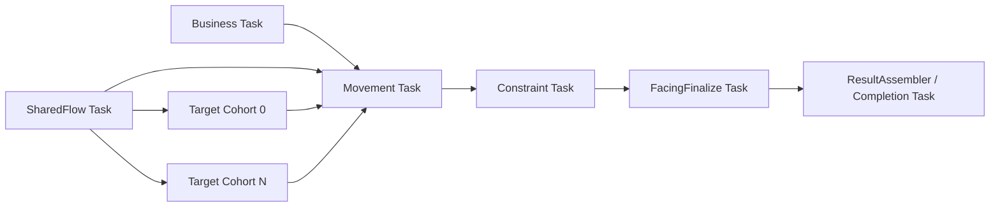
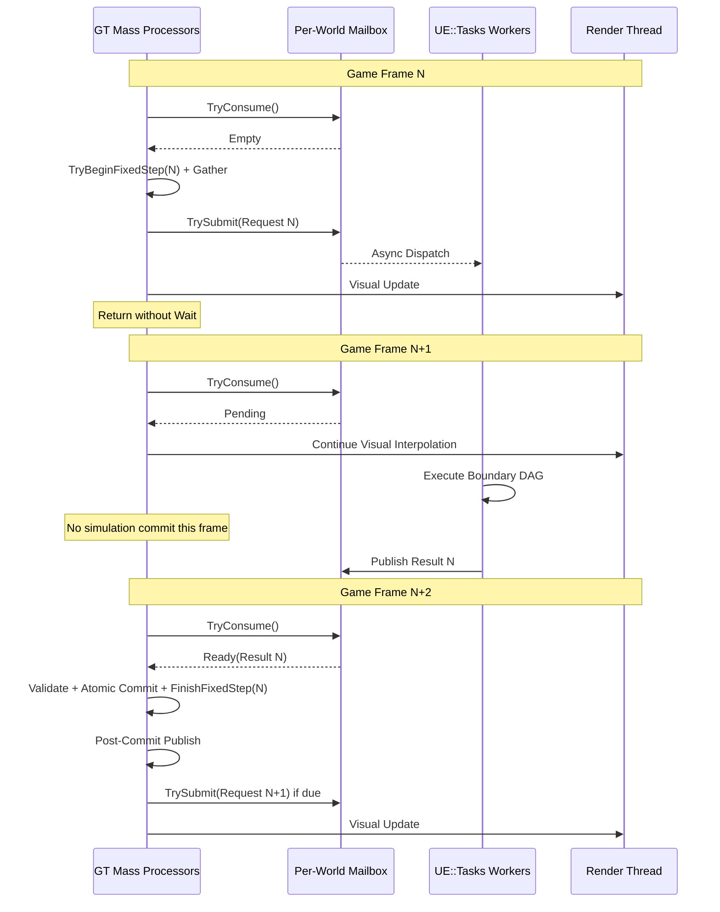

# MassAI 异步 Fixed-Step Boundary 生产消费架构

## 0. 文档状态与事实优先级

[INFERRED][HIGH] 本文是2026-07-30确认的目标架构合同，定义RoundSim fixed-step从“GT派发后立即等待”迁移到“单槽Mailbox、跨帧Poll、完整结果原子提交”的实施边界。

[COMPUTED][HIGH] 2026-07-30代码已完成AB1/AB2基础合同：Orchestrator/Runner使用`PollAndDrain()`和`FTask::IsCompleted()`，Runtime已删除`FEvent`与`WaitAndDrain()`；Runner自身就是每World深度1 Mailbox并携带Generation/PlanRevision/FixedStep/SnapshotHash事务身份。

[COMPUTED][HIGH] Round、Friendly和Mixed生产入口已经改为跨 Game Frame Poll；Round 每帧最多 Poll、Commit、Publish、Submit 各一次。2026-07-30 四节点直接执行切换后的 Development Editor `-DisableUnity`、插件事务定向 1/1 和项目架构 2/2 已通过；完整自动化、DebugGame/Unity 构建、单进程双 PIE、Correction/teardown 专项和 FFmpeg 连续性门仍须基于新代码重跑，因此不得外推为 AB 阶段已经生产验收关闭。

[INFERRED][HIGH] 本文是异步Boundary线程、Processor、Mailbox和调度合同的事实源；当前代码事实仍以`CurrentArchitecture.md`为准，实施顺序以`PhasePlan.md`为准，查询所有权以`MassQueryOwnershipMatrix.md`为准，验收门以`TestScenarioMatrix.md`为准。

[INFERRED][HIGH] 本文继续约束当前深度1完整Boundary及PW迁移期的强一致Domain；下一代“Worker持久权威镜像、连续调度、GT每帧交换可变Dirty Result Batch”目标不由本文替代描述，详细合同见`PersistentWorkerSimulationArchitecture.md`。

## 1. 目标与非目标

### 1.1 目标

[INFERRED][HIGH] 普通Game Tick中不得因为Boundary Worker未完成而调用`Wait()`、`WaitAndDrain()`、`Future.Get()`、`Event->Wait()`或任何等价阻塞入口。

[INFERRED][HIGH] GT只负责应用Plan/Correction、读取Mass持久事实、构造不可变Request、非阻塞消费完整Result、完整集合验证、唯一原子Commit和提交后发布。

[INFERRED][HIGH] UE::Tasks Worker只消费不可变POD/SoA Request，执行全群体纯计算，并一次发布完整Result；Worker不得访问`FMassEntityManager`、Mass Fragment View、`UWorld`、Actor、Component或其他UObject。

[INFERRED][HIGH] 每个World最多允许一个Boundary Request处于InFlight；第N+1步只能在第N步Result成功Commit后Gather。

[INFERRED][HIGH] Fixed Step继续使用稳定步长、FixedStepIndex和ServerTime语义；异步迁移不得跳过Server权威步、改变算法参数或以降低实体数量掩盖性能问题。

[INFERRED][HIGH] Server、Client、Rollback、Correction、Stable Hash、Prepared Patch和唯一GT writer的现有确定性与原子性合同必须保持。

### 1.2 非目标

[INFERRED][HIGH] 本阶段不要求所有Mass Processor都设置`bRequiresGameThreadExecution=false`，也不把所有算法强行改成`ParallelForEachEntityChunk()`。

[INFERRED][HIGH] 本阶段不修改FixedStepSeconds、目标站位规则、Particle参数、视觉表现、网络协议或T1–T9业务语义。

[INFERRED][HIGH] 本阶段不引入无界任务队列、多步预测队列或Worker直接写Mass的旁路。

[INFERRED][HIGH] Client严重落后时是否直接采用权威Checkpoint属于后续网络策略，不作为第一版异步Boundary的完成条件。

## 2. 三层执行模型



[INFERRED][HIGH] Fixed Step定义“模拟时间推进多少”；Mass Processor定义“何时访问和提交Mass数据”；UE::Tasks定义“全群体纯计算在哪些Worker线程执行”。三者职责正交。

## 3. Processor分类与执行顺序

### 3.1 GT Processor

[INFERRED][HIGH] 下列Processor直接访问Mass、World、复制状态或提交副作用，因此目标架构默认`bRequiresGameThreadExecution=true`。

| 目标Processor角色 | Mass Phase/顺序 | 输入 | 输出或副作用 | Pending时行为 |
|---|---|---|---|---|
| `RoundPlanAndCorrectionApplyProcessor` | [INFERRED][HIGH] `PrePhysics`，在Boundary消费前，位于`MassReplicationProcessor`之后 | [INFERRED][HIGH] 新Plan、Correction、Round启动/停止事实 | [INFERRED][HIGH] 应用合法变更；增加Mailbox Generation；使旧InFlight Result失效 | [INFERRED][HIGH] 无变更即返回 |
| `RoundBoundaryResultCommitProcessor` | [INFERRED][HIGH] Plan/Correction之后 | [INFERRED][HIGH] Mailbox Result Slot、当前Mass身份/Lifecycle/Revision | [INFERRED][HIGH] `TryConsume`、事务身份校验、完整集合预验证、唯一原子写回、`FinishFixedStep()` | [INFERRED][HIGH] Empty/Pending立即返回 |
| `RoundPostCommitPublishProcessor` | [INFERRED][HIGH] Result Commit之后 | [INFERRED][HIGH] 本帧成功Commit标记和prepared final records | [INFERRED][HIGH] 指标、Authority/ClientPrediction状态、Checkpoint、RoundResult和诊断 | [INFERRED][HIGH] 本帧无Commit即返回 |
| `RoundBoundaryRequestSubmitProcessor` | [INFERRED][HIGH] Post-Commit之后、Visual之前 | [INFERRED][HIGH] ServerTime、当前Plan、Mass持久Fragments、Behavior/Combat/Business overlay、缓存资源 | [INFERRED][HIGH] `TryBeginFixedStep()`、一次canonical Gather、构造Request、`TrySubmit()` | [INFERRED][HIGH] Mailbox InFlight或尚未到下一Fixed Step即返回 |
| `CrowdDemoClientVisualMassProcessor` | [INFERRED][HIGH] Request Submit之后 | [INFERRED][HIGH] 最近已Commit的权威/预测状态、视觉插值时钟 | [INFERRED][HIGH] 更新客户端Presentation与Render数据 | [INFERRED][HIGH] Boundary Pending不影响每帧视觉插值 |

[INFERRED][HIGH] 目标执行顺序固定为：

```text
MassReplication
→ Plan/Correction Apply
→ Result TryConsume + Validate + Commit
→ Post-Commit Publish
→ Request TryBegin + Gather + TrySubmit
→ Client Visual Interpolation
```

[COMPUTED][HIGH] 现行实现由四个显式注册到 `PrePhysics` 的 Processor 按 AuthorityInput、ResultCommit、PostCommit、RequestSubmit 顺序执行；同一 Game Frame 可以先 Commit 已完成的第 N 步，再为第 N+1 步 Gather 并 Submit，但不得等待第 N+1 步完成。旧单顶层 Processor 已删除。

[INFERRED][HIGH] 现有多次手工`CallExecute()`且靠内部可变状态推断“Stage/Consume/Apply”的动态Processor模式必须退出目标生产路径。

### 3.2 非GT Mass Work Processor

[COMMON][HIGH] 非GT Mass Work Processor指真正由Mass Processor图调度、设置`bRequiresGameThreadExecution=false`的`UMassProcessor`，它不是Boundary Thread Pool Task。

[INFERRED][HIGH] 只有满足下列全部条件的工作才进入非GT Mass Work Processor：

- [INFERRED][HIGH] 输入和输出可以通过合法Mass Query声明。
- [INFERRED][HIGH] 不访问GT-only Subsystem或UObject。
- [INFERRED][HIGH] Entity/Chunk之间不存在需要全群体一致快照的交叉依赖。
- [INFERRED][HIGH] 工作必须在当前Mass Processing Phase结束前完成，不要求跨Game Frame保留InFlight状态。

[INFERRED][HIGH] 第一版异步Boundary不强制新增非GT Mass Processor；局部视觉筛选、无跨实体依赖的标签或纯局部状态更新可以后续按Profiler证据迁入。

### 3.3 Boundary Work Stage

[INFERRED][HIGH] Boundary Work Stage是普通C++纯工作类，不继承`UMassProcessor`，由UE::Tasks Worker执行。

| Work Stage | 目标实现/现有核心 | 主要输入 | 主要输出 |
|---|---|---|---|
| `BusinessWork` | [COMPUTED][HIGH] 现有`RunBoundaryBusinessWork`及Prepared Business/Combat Adapter | [INFERRED][HIGH] Request中的Business、Attack、Projectile、Hit、Reactive和Behavior事实 | [INFERRED][HIGH] Guidance overlay、Reactive steps、Combat/Projectile prepared patch、事件 |
| `SharedFlowWork` | [COMPUTED][HIGH] `FCrowdMassSharedFlowWork` | [INFERRED][HIGH] Boundary Snapshot、Flow resource、目标/停止事实 | [INFERRED][HIGH] 稳定排序的SharedFlow candidates |
| `TargetRegionWork` | [COMPUTED][HIGH] `FCrowdMassTargetRegionWork` | [INFERRED][HIGH] Cohort、Topology key/cache、SharedFlow、Target settings | [INFERRED][HIGH] Topology、Demand、Plan、Execution、Validation、Guidance |
| `MovementPipelineWork` | [COMPUTED][HIGH] `FCrowdMassMovementPipelineWork` | [INFERRED][HIGH] Snapshot、Business/SharedFlow/Target overlays、Resolved Sources | [INFERRED][HIGH] Composed Guidance、Local Predictive和Predicted Movement |
| `ConstraintWork` | [COMPUTED][HIGH] `FCrowdMassParticlePipelineWork`或现有Obstacle纯Kernel | [INFERRED][HIGH] Predicted Movement、Particle/Obstacle settings、稳定Spatial facts | [INFERRED][HIGH] Final kinematics、Particle/Obstacle prepared facts |
| `FacingFinalizeWork` | [COMPUTED][HIGH] `FCrowdMassFacingFinalizeWork` | [INFERRED][HIGH] Final kinematics、Facing settings、上一Boundary settle facts | [INFERRED][HIGH] Facing结果、Stable CommitPlan候选和最终记录候选 |
| `ResultAssembler` | [INFERRED][HIGH] 新增纯组装阶段 | [INFERRED][HIGH] 全部Stage Result和Stable Hash | [INFERRED][HIGH] 单一`FCrowdBoundaryWorkResult` |

[INFERRED][HIGH] 当前仅负责Stage输入组装、调用纯Work或消费结果的动态`UMassProcessor`应逐步删除或改名为普通Builder/Adapter，避免把“Mass Processor”和“Worker Stage”混为一层。

### 3.4 模块所有权

| 模块 | 目标所有权 | 禁止内容 |
|---|---|---|
| `MassCrowdCore` | [INFERRED][HIGH] 稳定纯POD、排序、Hash及SharedFlow/Target/Movement/Constraint/Facing纯Kernel | [INFERRED][HIGH] MassEntity、Thread、World、Round、Demo或Mailbox生命周期 |
| `MassCrowdRuntime` | [INFERRED][HIGH] 通用Boundary Task描述、Orchestrator非阻塞状态、Mailbox基础类、通用Request/Result envelope和Task telemetry | [INFERRED][HIGH] T1–T9、具体地图、Demo Business字段或客户端视觉 |
| `MassCrowdDemoBusiness` | [INFERRED][HIGH] Business Planner、Host Work Adapter和Prepared Business/Combat Patch | [INFERRED][HIGH] MassEntity、World、线程池控制或直接Commit |
| `MassAICrowdDemo` | [INFERRED][HIGH] Round GT Processors、场景Request Adapter、Target/Flow资源宿主、事务校验Adapter、Demo指标和Checkpoint | [INFERRED][HIGH] 第二套通用Mailbox/Orchestrator或Core算法复制 |
| `MassCrowdNetworking` | [INFERRED][HIGH] Plan/Correction/Checkpoint传输和Generation失效输入 | [INFERRED][HIGH] 决定Worker调度、直接消费Task Result或写运动Fragment |
| `MassCrowdPresentation`与Demo Visual Sink | [INFERRED][HIGH] 最近已Commit状态的实例生命周期、插值和Render数据发布 | [INFERRED][HIGH] 等待Boundary、决定Fixed Step或修改权威模拟 |

[INFERRED][HIGH] 通用Mailbox和非阻塞Orchestrator必须位于`MassCrowdRuntime`；Round Request中包含的Demo专用Business、规则和诊断通过宿主Adapter装配，不得反向污染Runtime/Core公共结构。

## 4. UE::Tasks Thread Pool任务图

### 4.1 逻辑依赖



[INFERRED][HIGH] 逻辑DAG和Stable Hash不得依赖任务实际完成顺序；所有数组在进入Work Stage前按StableEntityRef、AgentId、CohortKey或对应稳定键排序。

[INFERRED][HIGH] `ResultAssembler`只有在全部前置Task成功后才构造完整Result；任一Task失败时发布`Failed Result`，不得发布半套Movement、Combat或Target资源。

### 4.2 物理Task粒度

[INFERRED][HIGH] AB1/AB2首先保持现有逻辑Stage粒度以降低行为迁移风险，并新增每Task queue/run/critical-path遥测。

| AB1/AB2 Thread Pool Task | 每Boundary数量 | 说明 |
|---|---:|---|
| `Business` | [INFERRED][HIGH] 1 | [INFERRED][HIGH] 与SharedFlow并行启动 |
| `SharedFlow` | [INFERRED][HIGH] 1 | [INFERRED][HIGH] 产出所有Cohort共享的Flow结果与Lookup |
| `TargetTopology` | [INFERRED][HIGH] 每Cohort 1；缓存命中为0 | [INFERRED][HIGH] 不依赖SharedFlow |
| `TargetDemand` | [INFERRED][HIGH] 每Cohort 1 | [INFERRED][HIGH] 依赖Topology与SharedFlow |
| `TargetPlan` | [INFERRED][HIGH] 每Cohort 1 | [INFERRED][HIGH] 依赖Demand |
| `TargetGuidance` | [INFERRED][HIGH] 每Cohort 1 | [INFERRED][HIGH] 依赖Plan |
| `Movement` | [INFERRED][HIGH] 1 | [INFERRED][HIGH] 依赖Business、SharedFlow及全部Guidance |
| `Constraint` | [INFERRED][HIGH] 1 | [INFERRED][HIGH] SoftPressure为Particle，SF1为Obstacle |
| `FacingFinalize` | [INFERRED][HIGH] 1 | [INFERRED][HIGH] 生成最终运动和Commit候选 |
| `ResultAssembler/Completion` | [INFERRED][HIGH] 1 | [INFERRED][HIGH] 只组装并发布Result，不唤醒GT等待 |

[COMPUTED][HIGH] 当前Orchestrator日志不计Completion Task，因此有C个Target Cohort时记录任务数为`5 + 4C`：T5的C=1记录9个，T6的C=7记录33个；实际还存在一个Completion Task。

[INFERRED][MED] AB4依据真实遥测决定Target Cohort的物理Task粒度：允许保留`Topology→Demand→Plan→Guidance`四Task链，或合并为每Cohort一个Task；不得仅依据Task数量决定合并。

[INFERRED][MED] 若AB4遥测证明合并有利，则缓存命中的Target可收敛为每Cohort一个`Demand→Plan→Guidance` Task，缓存未命中可使用一个完整`Topology→Demand→Plan→Guidance` Task；此时非Completion任务数由`5+4C`降为`5+C`，T5为6、T6为12。

[INFERRED][HIGH] 静态Target Topology缓存命中时不得创建无意义的BuildTopology Task；缓存键必须覆盖Target拓扑相关设置、Flow topology revision、Capability profile/cohort和环境障碍revision。

[INFERRED][HIGH] SharedFlow的`AgentId→FlowOutput`索引每个Boundary最多构建一次，并作为只读Lookup共享给各Cohort。

### 4.3 Thread Pool约束

[INFERRED][HIGH] Worker Task默认使用普通优先级并共享UE::Tasks Worker Pool；不得通过持续High Priority抢占Render/RHI或其他引擎关键任务来制造表面性能通过。

[INFERRED][HIGH] Worker闭包只允许捕获Request的线程安全共享所有权、Result Builder和纯值配置；禁止捕获裸`UWorld*`、Subsystem、Processor、EntityManager、Fragment View或指向GT对象的裸回调。

[INFERRED][HIGH] Completion Task只负责以Release语义把Result发布为Ready；它不得触发要求GT同步响应的`FEvent`。

## 5. Mailbox与数据合同

### 5.1 每World单槽Mailbox

```cpp
enum class ECrowdBoundaryMailboxState : uint8
{
    Empty,
    InFlight,
    Ready,
    Failed,
    Invalidated
};

class FCrowdBoundaryMailbox
{
public:
    bool TrySubmit(FCrowdBoundaryWorkRequest&& Request);
    ECrowdBoundaryPollResult Poll() const;
    bool TryConsume(FCrowdBoundaryWorkResult& OutResult);
    bool HasInFlightWork() const;
    void Invalidate(uint64 NewGeneration);
};
```

[INFERRED][HIGH] 每个`UWorld`/Round Pipeline Subsystem拥有独立Mailbox；Listen Server World与Client World不共享Request、Result或模拟状态，只共享底层UE Worker Pool。

[INFERRED][HIGH] `TrySubmit()`只允许`Empty→InFlight`，`TryConsume()`只允许`Ready/Failed→Empty`；其他状态转换必须fail-closed并记录VIOLATION。

[INFERRED][HIGH] Mailbox队列深度固定为1，因为Request N+1依赖Result N提交后的Mass持久状态；禁止在Result N未Commit时预先Gather N+1。

### 5.2 Work Request

```cpp
struct FCrowdBoundaryTransactionId
{
    uint64 WorldGeneration;
    int32 RoundId;
    int32 PlanRevision;
    int32 FixedStepIndex;
    int32 BoundarySequence;
    uint64 SnapshotHash;
};

struct FCrowdBoundaryWorkRequest
{
    FCrowdBoundaryTransactionId Transaction;
    float StepStartServerTimeSeconds;
    float StepEndServerTimeSeconds;
    float FixedStepSeconds;
    FCrowdMassBoundarySnapshot Snapshot;
    FCrowdBoundaryBusinessInput Business;
    FCrowdBoundarySharedFlowInput SharedFlow;
    TArray<FCrowdBoundaryTargetCohortInput> TargetCohorts;
    FCrowdBoundaryMovementInput Movement;
    FCrowdBoundaryConstraintInput Constraint;
    FCrowdBoundaryFacingInput Facing;
};
```

[INFERRED][HIGH] Request是单次Boundary事务的不可变快照，不是跨Boundary第二权威；唯一持久权威继续位于Mass Fragment、Runtime Store和版本化资源。

[INFERRED][HIGH] Request构造完成并成功`TrySubmit()`后，GT不得修改其数组或引用；Worker不得把Request内部地址保存到Result生命周期之外。

### 5.3 Work Result

```cpp
struct FCrowdBoundaryWorkResult
{
    FCrowdBoundaryTransactionId Transaction;
    FCrowdBoundaryPreparedBusiness Business;
    FCrowdBoundaryPreparedTargetResources TargetResources;
    FCrowdMassCommitPlan MovementCommitPlan;
    FCrowdBoundaryPreparedCombat Combat;
    FCrowdBoundaryPreparedCheckpointFacts CheckpointFacts;
    FCrowdBoundaryTaskTelemetry TaskTelemetry;
    uint64 StableHash;
    bool bSucceeded;
};
```

[INFERRED][HIGH] Result只包含Prepared数据和诊断，不直接携带可执行UObject回调；GT在消费时必须重新验证事务身份、Agent完整集合、Lifecycle、当前Plan Revision、Commit目标集合和Hash。

[INFERRED][HIGH] TaskTelemetry不得进入确定性Stable Hash或网络业务Hash。

## 6. 跨Game Frame时序



[INFERRED][HIGH] `bStepInProgress`允许跨多个Game Frame保持true；只有Result成功Commit或事务明确失败/失效后才能清除。

[INFERRED][HIGH] Pending帧只跳过本次模拟Commit，不跳过Game Tick、网络处理、视觉插值、Render Thread或GPU提交。

## 7. Fixed-Step调度合同

[COMPUTED][HIGH] 当前默认FixedStepSeconds为`1/30`秒；TargetServerTime由Server WorldTime或Client同步ServerTime提供。

[INFERRED][HIGH] 目标调度每个World最多在一个Game Frame内Commit一个已完成Boundary并Submit一个新Boundary；不得在同一帧循环Dispatch/Wait多个Step。

[INFERRED][HIGH] Server不得丢弃权威Fixed Step或通过扩大FixedStepSeconds追赶；Worker吞吐不足必须表现为backlog和性能门失败。

[INFERRED][HIGH] Client correction到达时先执行Plan/Correction Apply并增加Generation，再消费Mailbox；旧Generation Result必须丢弃且不得产生部分Commit。

[INFERRED][HIGH] 单槽Mailbox不保证Worker吞吐，只有Worker critical path持续低于FixedStep周期且GT Gather/Commit足够短时才能维持实时模拟；性能门必须分别测量这两个条件。

## 8. 原子性、线程安全与生命周期

[INFERRED][HIGH] GT是Mass持久状态、Mailbox控制状态和最终Commit的唯一writer；Worker是当前Result Builder的唯一writer。

[INFERRED][HIGH] Result发布采用Release、GT消费采用Acquire或由等价线程安全任务完成合同保证；GT只在Ready后读取Result。

[INFERRED][HIGH] Worker任务之间只能通过DAG前置关系和各自唯一输出槽传递数据；两个并行Task不得写同一容器、同一Result字段或共享可变缓存。

[INFERRED][HIGH] 地图关闭、PIE停止、Round替换或Subsystem Deinitialize时先`Invalidate(NewGeneration)`并断开GT消费；尚未完成的Worker可以安全结束并释放只由shared ownership持有的Request/Builder，但不得回调已销毁World。

[INFERRED][HIGH] 目标实现移除Completion Task对裸`FEvent*`的捕获；测试/进程关闭若需要阻塞清理，必须使用独立且明确命名的teardown-only入口，普通Tick不得调用。

## 9. Server、Client与UE线程

[INFERRED][HIGH] 单进程PIE中Server World和Client World各自运行GT Processor链、各自拥有Mailbox和FixedStep状态，但它们共享同一个Game Thread和UE Worker Pool。

[INFERRED][HIGH] 目标架构中Server/Client GT工作仍按Mass Phase顺序执行，但每端只承担Gather/Validate/Commit的短工作，不再各自同步等待完整Worker DAG。

[INFERRED][HIGH] Render Thread、RHI Thread和GPU只消费Client Visual Processor发布的最近已Commit/插值状态；它们不等待Boundary Result。

[INFERRED][HIGH] Worker Pool容量被Server和Client共同消耗，因此必须记录process-wide Worker critical path、排队时间和每World公平性；不得只看单World 16ms预算。

## 10. 失败、失效与恢复

| 情况 | 目标行为 |
|---|---|
| [INFERRED][HIGH] Worker Stage失败 | [INFERRED][HIGH] 发布Failed Result；GT记录任务键和原因；不提交任何Prepared数据 |
| [INFERRED][HIGH] Result事务身份不匹配 | [INFERRED][HIGH] 丢弃Result、清空Mailbox、记录stale；不写Mass |
| [INFERRED][HIGH] 完整Agent/Lifecycle预验证失败 | [INFERRED][HIGH] 整批拒绝；保持上一个已Commit状态 |
| [INFERRED][HIGH] 新Plan/Correction使InFlight失效 | [INFERRED][HIGH] 增加Generation；旧Result到达后丢弃；按新权威状态重新Gather |
| [INFERRED][HIGH] Worker长期超过FixedStep周期 | [INFERRED][HIGH] backlog门失败并输出critical-path；不得静默降频或丢Server Step |
| [INFERRED][HIGH] World teardown | [INFERRED][HIGH] Invalidate并断开GT对象；Worker仅释放纯数据所有权 |

## 11. 性能与诊断合同

[INFERRED][HIGH] 现有`FacingFinalizeStageMs`不能继续代表Worker算法耗时；目标指标至少拆分为：

- [INFERRED][HIGH] `boundary_gather_gt_ms`
- [INFERRED][HIGH] `boundary_dispatch_gt_ms`
- [INFERRED][HIGH] `boundary_worker_queue_ms`
- [INFERRED][HIGH] `boundary_worker_critical_path_ms`
- [INFERRED][HIGH] `boundary_worker_cpu_sum_ms`
- [INFERRED][HIGH] `boundary_result_age_frames`
- [INFERRED][HIGH] `boundary_validate_gt_ms`
- [INFERRED][HIGH] `boundary_commit_gt_ms`
- [INFERRED][HIGH] `ordinary_gt_block_wait_count`
- [INFERRED][HIGH] `mailbox_pending_frame_count`
- [INFERRED][HIGH] `mailbox_stale_result_count`
- [INFERRED][HIGH] `backlog_ms_p50/p95/max`

[INFERRED][HIGH] 每Task遥测至少包含StageId、TaskTypeId、Scope/Cohort、enqueue/start/finish、queue/run time、成功标志和是否在GT之外执行。

[INFERRED][HIGH] 任务计时、线程ID和墙钟时间只用于诊断，不进入确定性Hash。

## 12. 当前实现到目标实现的映射

| 当前实现 | 当前问题 | 目标归属 |
|---|---|---|
| 四个 Round Boundary Processor | [COMPUTED][HIGH] AuthorityInput、ResultCommit、PostCommit、RequestSubmit 已分别注册并声明显式顺序；旧单顶层 Processor 已删除 | [COMPUTED][HIGH] 四节点直接调用纯 C++ Stage；跨帧事务由 World Subsystem 持有 |
| 原 `ROUND_DYNAMIC_FLAGS` 与手工 `CallExecute()` | [COMPUTED][HIGH] 生产源码已经清零，内部算法不再伪装为未注册 `UMassProcessor` 或 `UObject` Processor | [COMPUTED][HIGH] Mass 调度权只属于四个真实 Processor；阶段算法为普通 C++ Stage |
| `FCrowdMassBoundaryOrchestrator::WaitAndDrain()` | [COMPUTED][HIGH] GT同步等待Completion Event | [INFERRED][HIGH] `Poll/TryConsume`非阻塞Mailbox |
| Completion Task捕获裸`FEvent*` | [COMPUTED][HIGH] 跨帧后存在teardown生命周期风险 | [INFERRED][HIGH] Task完成后仅发布线程安全Result状态 |
| `FacingFinalize`包围Dispatch后的Wait | [COMPUTED][HIGH] Stage指标吞并整条Worker等待 | [INFERRED][HIGH] Worker critical path与GT commit分别计时 |
| Target staged路径每步BuildTopology | [COMPUTED][HIGH] 旧同步缓存分支被current snapshot早退跳过 | [INFERRED][HIGH] Worker-side版本化Topology cache |
| 每Cohort Demand重复构建Flow lookup | [COMPUTED][HIGH] 同一Boundary重复工作 | [INFERRED][HIGH] Request级只读共享lookup |

## 13. 自动化与验收

### 13.1 Orchestrator/Mailbox单元测试

- [INFERRED][HIGH] `TryConsume()`在Worker未完成时立即返回Pending，禁止阻塞。
- [INFERRED][HIGH] Completion前不能Merge或Commit。
- [INFERRED][HIGH] 成功Result只可消费一次；重复消费和重复Submit被拒绝。
- [INFERRED][HIGH] 任一Task失败时整批Failed，零Prepared副作用。
- [INFERRED][HIGH] Dependency顺序、正反输入、不同实际完成顺序产生相同Stable Hash。
- [INFERRED][HIGH] Generation、PlanRevision、FixedStepIndex、BoundarySequence或SnapshotHash不匹配时整批拒绝。
- [INFERRED][HIGH] Teardown后Worker完成不访问World且无悬空Event。

### 13.2 Fixed-Step调度测试

- [INFERRED][HIGH] Fake clock覆盖100FPS、30FPS、20FPS和单次长卡顿；验证不丢Server Step且每World最多一个InFlight。
- [INFERRED][HIGH] Pending期间视觉与网络Processor继续执行。
- [INFERRED][HIGH] Commit N后才可Gather N+1。
- [INFERRED][HIGH] Correction使旧Result失效，并从新权威状态重新Gather。

### 13.3 Work等价与缓存测试

- [INFERRED][HIGH] Business、SharedFlow、Target、Movement、Constraint、Facing的迁移前后Stage Hash和最终Commit Hash一致。
- [INFERRED][HIGH] 1个与7个Cohort、输入反序、缓存命中/失效均保持确定性。
- [INFERRED][HIGH] Static Target Topology只在key/revision变化时重建。
- [INFERRED][HIGH] SharedFlow lookup每Boundary构建一次。

### 13.4 真实场景门

[INFERRED][HIGH] 第一批生产验收固定为T5S、T5M、T6A、T6S和T6M，分别运行独立Server/Client性能轮和编辑器单进程双PIE轮。

[INFERRED][HIGH] `fixed_step_ms`在异步实现中是Request Submit到Result Commit的端到端墙钟延迟，门槛为p95≤66.667ms；`client_frame p95≤33.333ms`、`visual p95≤16.667ms`、`simulation_realtime_factor≥0.95`、`max_step_limit_hit_count=0`和零非Correction不连续继续保持。

[INFERRED][HIGH] 新门要求稳态`ordinary_gt_block_wait_count=0`、`catchup_cpu_budget_hit_count=0`、`backlog_ms_p95≤66.667ms`；启动、Round reset和首次资源初始化单列，不得混入稳态通过结论。

[COMPUTED][HIGH] 深度1 Mailbox若要维持30Hz Fixed Step，Game/Server Tick必须高于30Hz以提供独立的提交帧与消费帧；当前`IpNetDriver.NetServerMaxTickRate=60`、`MaxNetTickRate=120`。30Hz Server Tick与30Hz Fixed Step组合没有漂移余量，不能作为本架构的有效运行配置。

[INFERRED][HIGH] FFmpeg录像、contact sheet和状态sidecar用于连续性与表现验收；性能真值首先来自关闭录屏/标签的运行。

## 14. 实施切片

AB0. [x] [INFERRED][HIGH] 文档设计：冻结Processor分类、Mailbox、Request/Result、线程所有权、跨帧时序、失败合同和验收门；不修改代码。

AB1. [x] [COMPUTED][HIGH] Orchestrator/Runner已提供非阻塞`PollAndDrain()`；Task记录queue/run/end-to-end，普通Tick阻塞等待接口已从Runtime删除，定向Boundary自动化7/7通过。

AB2. [x] [COMPUTED][HIGH] Runner已作为深度1 Mailbox保存事务身份；Round/Friendly/Mixed各自持有一个Runner，Plan/teardown递增Generation，旧任务只持有ThreadSafe WorkState。

AB3. [x] [COMPUTED][HIGH] Round代码与T5S真实门已完成：`bStepInProgress`允许跨帧，Pending立即返回，单帧最多一消费一生产；8822 T5S达到inside=`20`、coverage=`16/16`、稳定诊断valid=`1`、fixed-step p95=`17.980ms`、backlog p95=`31.284ms`，阻塞/stale/catch-up均为0。

[COMPUTED][HIGH] 权威输入顺序已修正为Plan/Correction/RoundResult apply先于Mailbox Poll；Correction到达会重开PlanApply boundary，在途事务递增Generation并从GT mailbox丢弃，旧Worker可自然结束但不再有提交入口。8827 T5S普通双端Correction流通过双端input/flow hash一致、无VIOLATION，fixed-step/backlog p95=`17.639/32.070ms`。

AB4. [x] [COMPUTED][HIGH] T5/T6推广与Worker优化已完成：Request级Flow lookup同时供Demand与Guidance复用，静态拓扑在Worker State跨Fixed Step缓存；8824 T5M、8825 T6A、8826 T6S和8823 T6M均通过功能与性能门。T6A/T6S分别只有7次Topology build并命中7329/6300次缓存；当前遥测没有要求在本切片合并Cohort Task。

AB5. [ ] [COMPUTED][HIGH] 四节点目标合同已冻结到`AB5FourNodeBoundaryContract.md`；四个 Processor 已成为唯一生产路径，旧单顶层 Processor、UObject Stage Adapter、手工 `CallExecute()` 和阻塞 Wait 均已删除。通用 Frame Transaction/1-0-1 Mass 访问合同已下沉 `MassCrowdRuntime`；Base/Target/Combat template 与 Optional Query 已实现，最新四构建、MassCrowd 85/85、CrowdDemo 139/139通过。Base+Target T5S 9321/9322功能绿，但backlog p95=`170.807/136.398ms`未过`66.667ms`，尚缺该回退修复与完整真实场景矩阵。

AB6. [ ] [COMPUTED][HIGH] 当前四构建、MassCrowd 85/85、CrowdDemo 138/138、单进程双PIE及新T5S/T6M已通过；仍缺强制Pending Correction、异步完成顺序确定性、teardown/地图切换、T1–T9/Mixed/Friendly/Continuous全回归与FFmpeg连续性。

## 15. 完成定义

[INFERRED][HIGH] 同时满足以下条件才可宣布架构完成：

- [INFERRED][HIGH] 普通Tick源码和运行计数均证明阻塞等待为0。
- [INFERRED][HIGH] 每World最多一个InFlight Boundary，Commit N前不能Gather N+1。
- [INFERRED][HIGH] Worker不访问Mass/World/UObject，GT是唯一持久状态writer。
- [INFERRED][HIGH] 事务失效、Worker失败、集合不完整和teardown均为零部分写入。
- [INFERRED][HIGH] Server/Client Stable Hash、业务事件、运动安全、Target站位和Correction合同无回退。
- [INFERRED][HIGH] T5/T6单进程PIE不再出现由Boundary同步Wait触发的持续约20FPS状态。
- [INFERRED][HIGH] 文档、代码、测试、日志字段和验收脚本使用相同Processor/Mailbox/Task术语。

## 16. 禁止模式

```text
禁止：GT Processor → Dispatch → Wait/Get/Event.Wait → Commit
禁止：Worker → Mass Fragment/UWorld/UObject写入
禁止：Result N未Commit → Gather Request N+1
禁止：无界Request队列或多步旧Snapshot预测
禁止：Worker完成顺序影响Stable Hash
禁止：用降低实体数、增大FixedStep或关闭Client掩盖吞吐不足
```

[RULES I BROKE]：[COMPUTED][HIGH] 无。
