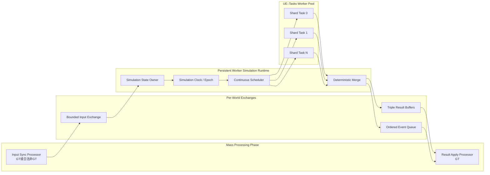

# MassAI 持久 Worker Simulation Runtime 架构

## 0. 文档状态

[INFERRED][HIGH] 本文保存PW0–PW8的设计与历史证据；其“混合Consistency Domain长期保留Boundary”结论已被WA0全面Worker权威方案取代。现行目标事实源为`FullWorkerAuthorityArchitecture.md`，字段切换状态以`FullWorkerAuthorityOwnershipMatrix.md`为准。

[COMPUTED][HIGH] PW1–PW8现已完成：持久Worker Runtime、权威SoA镜像、增量Input、短Task Scheduler、可变Published Batch及Movement Production Owner均已进入生产。Particle、Target和Combat当前仍留在深度1 Fixed-Step Boundary，但这只是WA迁移起点，不再是终态。

[INFERRED][HIGH] 本文不废除现有 Boundary Kernel、StableEntityRef、Generation、Prepared Patch、Stable Hash和非阻塞消费成果；迁移必须复用这些合同，并通过 Shadow Compare 证明新旧结果边界。

[INFERRED][HIGH] 实施阶段以`PhasePlan.md`中的PW0–PW8为准，完成状态以`FeatureChecklist.md`为准，规模与视觉验收最终进入`TestScenarioMatrix.md`。

## 1. 关键决策

[INFERRED][HIGH] 已迁移模拟域的权威状态归持久 Worker Runtime所有；Mass Fragment、Actor、ISM/VAT和其他场景对象是Worker结果的GT代理、表现缓存或网络适配数据，不再作为下一次Worker计算的隐式权威输入。

[INFERRED][HIGH] GT到Worker只发送Spawn、Despawn、Gameplay Command、环境/资源变更、规则变更和权威Correction；Worker到GT只发送版本化状态Patch与有序事件。Position、Velocity、Facing、Standing和Combat等同一字段不得同时由GT和Worker写入。

[INFERRED][HIGH] Worker持续推进模拟并持续积累Dirty Result，不规定每次发布固定实体数量，也不要求完成全部实体扫描后才允许发布。

[INFERRED][HIGH] GT每个Game Frame在固定Result Apply Phase只交换一次当前Published Batch，并完整消费交换时已经冻结的全部结果；Batch可能包含0、10、9999或任意实际数量，但GT不得追逐Worker仍在增长的实时队列尾部。

[INFERRED][HIGH] 计算推进频率、一次扫描处理量、Result发布时机和GT消费帧率是四个独立概念；不固定结果数量不等于取消模拟时间、版本或一致性边界。

[INFERRED][HIGH] 非GT Mass Work Processor可以执行必须在当前Mass Phase内结束的查询和局部计算，但不能成为跨Game Frame常驻模拟循环；持久状态、连续调度和跨帧结果交换由World级Worker Runtime拥有。

## 2. 目标与非目标

### 2.1 目标

[INFERRED][HIGH] GT不再为每个模拟步复制全部实体完整状态；正常路径只发布新增、删除、命令、资源版本和确实发生变化的输入字段。

[INFERRED][HIGH] Worker持有按StableEntityRef组织的连续SoA镜像，能够在GT没有新输入时继续按Server Simulation Time推进已知实体。

[INFERRED][HIGH] Worker内部允许使用一个状态Owner和多个短生命周期UE::Tasks Shard并行计算，不永久占用公共Task Pool线程。

[INFERRED][HIGH] GT只读取不可变Published Batch并执行批量Mass/Presentation写回；Worker不得访问FMassEntityManager、Mass Fragment View、UWorld、Actor、Component或其他UObject。

[INFERRED][HIGH] 输入、状态结果和事件都携带Generation、Sequence/Epoch、StableEntityRef与LifecycleSerial；旧Generation、旧Lifecycle或输入版本不匹配的结果必须fail-closed。

[INFERRED][HIGH] 当前强一致Boundary逐步缩小为真正需要集合原子性的Consistency Domain，而不是永久覆盖所有实体和所有业务。

### 2.2 非目标

[INFERRED][HIGH] 第一版不把所有Mass Fragment删除，也不一次性迁移所有Round/Mixed/Friendly/Continuous业务。

[INFERRED][HIGH] 第一版不允许Worker直接写Mass、Actor、ISM或网络对象，也不允许GT与Worker共同写同一模拟字段。

[INFERRED][HIGH] 第一版不引入无界Input/Result/Event队列，不通过静默丢弃Spawn、Despawn、Combat Event或Correction制造吞吐通过。

[INFERRED][HIGH] 第一版不承诺一亿逐实体权威模拟；首个规模目标按1k、2k、5k、10k实体阶梯验证。

[INFERRED][HIGH] 第一版不自动改变现有30Hz业务模拟规则；若某个Domain改用异步事件调度或独立Epoch，必须单独版本化并重新定义测试预期。

## 3. 权威数据所有权

### 3.1 单向输入与输出

```text
GT / Mass Authority Adapter
  └─ Input: Spawn / Despawn / Command / Environment / Correction
       ↓
Persistent Worker Simulation State
  └─ Output: State Patch / Gameplay Event / Diagnostic
       ↓
GT Mass / Scene / Presentation Proxy
```

[INFERRED][HIGH] 对已迁移字段，Worker State是唯一模拟权威；GT应用后的Mass Fragment是最后一次已消费Worker结果的代理版本。

[INFERRED][HIGH] GT不得把刚从Worker消费的位置、速度或行为状态在下一帧重新作为普通输入回送Worker；只有明确的Authority Correction才允许覆盖Worker状态，并且必须增加Generation或Correction Revision。

[INFERRED][HIGH] 尚未迁移的Domain继续使用现行Mass/Boundary权威；迁移期必须由字段级Ownership Matrix阻止同一字段双写。

### 3.2 输入分类

| 输入类别 | 生产者 | 丢弃/合并规则 | Worker应用边界 |
|---|---|---|---|
| Spawn | [INFERRED][HIGH] GT Lifecycle Adapter | [INFERRED][HIGH] 不得丢弃；按StableEntityRef/Lifecycle去重 | [INFERRED][HIGH] Owner应用后实体才可参与模拟 |
| Despawn | [INFERRED][HIGH] GT Lifecycle Adapter | [INFERRED][HIGH] 不得丢弃；高Lifecycle终止旧实体 | [INFERRED][HIGH] 先失效旧Task/Result，再移除镜像 |
| Gameplay Command | [INFERRED][HIGH] GT/Networking/Host Adapter | [INFERRED][HIGH] 按CommandId幂等；有序事件不得覆盖 | [INFERRED][HIGH] 指定Simulation Time或Input Sequence |
| Environment/Resource | [INFERRED][HIGH] GT Resource Adapter | [INFERRED][HIGH] latest-wins但Revision不得倒退 | [INFERRED][HIGH] 新Epoch开始前切换只读资源 |
| Correction | [INFERRED][HIGH] Authority/Networking | [INFERRED][HIGH] 不得丢弃；旧Revision拒绝 | [INFERRED][HIGH] 增加Generation并失效旧输出 |
| 可覆盖状态输入 | [INFERRED][HIGH] 明确的宿主传感/场景Adapter | [INFERRED][HIGH] 同实体同字段保留最新Sequence | [INFERRED][HIGH] 下一个安全Owner切片 |

## 4. 最终线程结构



### 4.1 GT Processor

[INFERRED][HIGH] `CrowdWorkerInputSyncProcessor`运行在声明完整访问依赖的Mass Phase，读取Lifecycle/Command/外部资源Dirty事实并发布Input Batch；需要访问World、Actor、Networking UObject或GT-only Subsystem的Adapter必须要求GT。

[INFERRED][HIGH] `CrowdWorkerResultApplyProcessor`默认要求GT，在固定Phase开始时交换一次Published Buffer，验证Generation/Lifecycle/Sequence并批量写入Mass代理Fragment、场景表现和网络发布缓存。

[INFERRED][HIGH] Result Apply不设固定实体数量上限；如果交换到9999项就批量消费9999项，并将GT apply时间超门视为性能失败，而不是静默截断业务结果。

### 4.2 非GT Mass Work Processor

[COMMON][HIGH] `bRequiresGameThreadExecution=false`只表示Processor可由Mass调度到非GT线程，不表示它拥有固定线程或能够跨Mass Phase常驻运行。

[INFERRED][HIGH] 非GT Mass Work Processor适用于在当前Phase内完成的合法Query、Dirty收集、局部筛选或无需跨帧状态的计算。

[INFERRED][HIGH] Processor若提交跨帧UE Task，必须在提交后返回且不得等待；Task只捕获复制后的POD、线程安全共享资源和Worker Runtime句柄，不得保留ExecutionContext、Fragment View或EntityManager。

### 4.3 Worker Runtime与UE Tasks

[INFERRED][HIGH] 每个World拥有一个`FCrowdAsyncSimulationRuntime`，由宿主Subsystem管理Start、Invalidate、Drain和Stop；Runtime拥有输入交换、Worker镜像、模拟时钟、调度器、输出交换和遥测。

[INFERRED][HIGH] Runtime的可变状态只能由一个逻辑Owner修改。实现可采用明确生命周期的Coordinator Thread，或采用严格串行的有界Pump Task链；不得用永不返回的UE Task永久占用公共Worker Pool线程。

[INFERRED][HIGH] Owner冻结当前Epoch/Shard输入后，将SharedFlow、Target、Movement、Particle、Facing和Business纯计算提交为短生命周期UE Tasks；Shard只写自己的输出槽，Owner或唯一Merge Task按稳定Key合并。

## 5. 数据合同

```cpp
struct FCrowdWorkerInputBatch
{
    uint64 Generation;
    uint64 FirstInputSequence;
    uint64 LastInputSequence;
    double TargetSimulationTimeSeconds;
    TArray<FCrowdWorkerSpawnDelta> Spawns;
    TArray<FCrowdWorkerDespawnDelta> Despawns;
    TArray<FCrowdWorkerCommandDelta> Commands;
    TArray<FCrowdWorkerStateDelta> StateDeltas;
    TArray<FCrowdWorkerResourceDelta> ResourceDeltas;
};

struct FCrowdWorkerStatePatch
{
    FCrowdStableEntityRef EntityRef;
    uint64 Generation;
    uint64 WorkerEpoch;
    uint64 SourceInputSequence;
    uint64 DirtyMask;
    FCrowdWorkerPublishedState State;
};

struct FCrowdWorkerPublishedBatch
{
    uint64 Generation;
    uint64 PublishSequence;
    uint64 MinWorkerEpoch;
    uint64 MaxWorkerEpoch;
    double PublishedSimulationTimeSeconds;
    TArray<FCrowdWorkerStatePatch> StatePatches;
    TArray<FCrowdWorkerGameplayEvent> OrderedEvents;
    uint64 StableHash;
};
```

[INFERRED][HIGH] Input Batch、Worker镜像与Published Batch不得持有UObject、Mass View或裸GT回调；资源通过不可变ThreadSafe共享句柄和显式Revision引用。

[INFERRED][HIGH] State Patch允许同一实体同一字段latest-wins合并；Gameplay Event按EventId/Sequence保持有序且不得被状态合并吞掉。

[INFERRED][HIGH] Worker只发布从已完整应用的Input Sequence和合法Simulation Epoch生成的结果；GT消费时重新验证当前Generation、Entity Lifecycle和字段Owner。

## 6. 可变Result Batch交换

### 6.1 三缓冲状态

```text
Building  : Worker正在追加/覆盖Dirty State
Published : Worker已冻结，等待GT交换
Consuming : GT本帧独占读取
```

[INFERRED][HIGH] GT每帧只执行一次`TryExchangePublishedBatch()`；交换成功后Consuming Batch不可变，Worker立即获得可继续写入的Building Buffer。

[INFERRED][HIGH] Result数量没有固定配额；交换边界只定义“截至本次交换已经冻结的结果集合”，交换之后的新结果自然进入后续Published Batch。

[INFERRED][HIGH] 若GT尚未消费上一Published Batch，Worker对可覆盖State Patch进行同Entity/同字段合并；不可覆盖Event进入有界有序队列。事件队列达到硬上限时必须Fail-Closed并输出VIOLATION，不能静默丢事件。

[INFERRED][HIGH] GT应使用排序SoA、预解析Target和Mass Chunk批量写回；禁止把9999项结果退化为9999次Actor/UObject细粒度调用。

### 6.2 初始全量与后续增量

[INFERRED][HIGH] 新World/新Generation首次同步可以发布完整实体状态；Worker建立Mirror后，正常帧只交换Dirty输入与Dirty输出。

[INFERRED][HIGH] Worker Mirror发生Sequence缺口、Hash不一致或资源Revision缺失时请求显式Resnapshot；不得在不告知GT的情况下继续基于不完整镜像演算。

## 7. 模拟时间与持续调度

[INFERRED][HIGH] Worker持续运行不等于按CPU速度任意推进游戏时间；所有业务移动、冷却、攻击和事件必须绑定Server Simulation Time。

[INFERRED][HIGH] 第一版保留现有Fixed Simulation Quantum作为Worker内部时间合同，但不要求每个Quantum发布固定数量结果，也不要求GT每个Frame看到完整全体结果。

[INFERRED][HIGH] Worker Scheduler可以按时间预算、就绪Shard和输入优先级选择工作；每个实体、Region或Consistency Domain必须记录已推进到的Worker Epoch/Simulation Time。

[INFERRED][HIGH] 若后续允许Region拥有独立Epoch，跨Region交互、迁移和网络Correction必须先有正式协议；PW阶段不得通过隐式混合时间版本绕过该设计。

## 8. 混合一致性Domain

[INFERRED][HIGH] 持久Worker镜像与可变Result Batch可以先落地，但部分结果提交只对明确允许的Domain开放。

| Domain | 初始权威/提交方式 | 允许流式State Patch | 必须保持的集合边界 |
|---|---|---|---|
| Presentation/VAT状态 | [INFERRED][HIGH] Worker状态→GT代理 | [INFERRED][HIGH] 是 | [INFERRED][HIGH] 单实体Lifecycle |
| SharedFlow采样/Facing | [INFERRED][HIGH] Worker镜像 | [INFERRED][HIGH] 是 | [INFERRED][HIGH] 输入Resource Revision |
| 独立Business状态 | [INFERRED][HIGH] 按业务声明 | [INFERRED][MED] 条件允许 | [INFERRED][HIGH] Command/Event顺序 |
| Movement | [INFERRED][HIGH] 先Shadow，再Worker权威 | [INFERRED][MED] 按Region/Island | [INFERRED][HIGH] 邻域输入Epoch |
| Particle/Collision | [INFERRED][HIGH] 现有Boundary保留 | [INFERRED][LOW] 不按任意实体批次 | [INFERRED][HIGH] Interaction Island/空间边界 |
| Target站位/配额 | [INFERRED][HIGH] 现有Cohort事务保留 | [INFERRED][LOW] 不按任意实体批次 | [INFERRED][HIGH] Cohort Demand/Plan |
| Combat/范围事件 | [INFERRED][HIGH] Prepared事务保留 | [INFERRED][LOW] 不按普通State覆盖 | [INFERRED][HIGH] Event Boundary与幂等集合 |

[INFERRED][HIGH] 一个Domain只有在Owner、Input Epoch、跨实体依赖、失效规则、网络语义和验收门全部冻结后，才能从完整Boundary切换为流式Patch。

## 9. 生命周期、背压与失效

[INFERRED][HIGH] Runtime状态至少包含`Stopped → Starting → Running → Invalidating/Draining → Stopped`，不可恢复错误进入`Failed`。

[INFERRED][HIGH] Plan替换、Authority Correction、World teardown和Subsystem Deinitialize增加Generation，停止接受旧Generation输入，断开旧输出消费，并允许只持有ThreadSafe数据的Shard自然结束。

[INFERRED][HIGH] Stop流程必须先停止调度新Shard，再等待或轮询已有Shard到明确teardown超时，最后释放Mirror与Buffers；不得由Worker回调已销毁World。

[INFERRED][HIGH] Input Exchange和Event Queue必须有硬容量；可覆盖状态使用latest-wins合并，有序事件保持完整。Worker落后通过Queue Age、Mirror Lag和Simulation Time Lag暴露，不得隐藏。

## 10. 从当前Boundary迁移

[INFERRED][HIGH] 当前深度1 Boundary在PW迁移期间继续作为黄金结果和强一致Domain执行器；新Worker Runtime先以Shadow模式消费相同输入但不得写生产Mass。

[INFERRED][HIGH] 迁移按“输入镜像→Shadow计算→内部分片→低耦合输出→Movement权威→强一致Domain评估”推进，不同时替换输入、算法、输出和网络四层。

[INFERRED][HIGH] 每个迁移切片必须具有显式Fallback：关闭对应Worker Domain Writer后，现有Boundary路径仍可独立运行并产生原黄金结果；Fallback只用于迁移验证，不长期保留双权威生产路径。

## 11. PW0–PW8实施方案

PW0. [x] [INFERRED][HIGH] 冻结本文档、权威所有权、线程结构、可变Batch语义、Processor边界、混合Domain和阶段验收；本阶段不修改生产代码。

PW1. [x] [COMPUTED][HIGH] `MassCrowdRuntime`已增加通用Input Batch、State Patch、Published Batch、Sequence/Generation校验和三缓冲Exchange；单元测试已覆盖，但未接入Demo生产。

PW2. [x] [COMPUTED][HIGH] 已增加每World`FCrowdAsyncSimulationRuntime`生命周期、Worker SoA Mirror、Input Owner、固定Simulation Time合同和teardown；测试宿主已验证Spawn/Despawn/Correction/Resnapshot，不写Mass结果。

PW3. [x] [COMPUTED][HIGH] Demo Round/Mixed/Friendly已接入Worker Input Sync，以现有Boundary Snapshot为初始全量，以Lifecycle、成功Commit的Command Journal、快照Resource和Dirty State为增量；Worker Shadow Mirror按已应用Input Sequence执行Entity/Lifecycle/State/源Snapshot元数据Hash比较且不写生产Mass。

PW4. [x] [COMPUTED][HIGH] SharedFlow sampling、Facing和独立Business已接入每World Runtime短Task Shadow Scheduler；Runtime限制单GT提交者、按Kernel强制递增Work Sequence、允许Task乱序完成但只按全局提交序交付，并在Invalidate/Stop时排空短Task。生产Round以自包含不可变输入逐步重复计算且不写Mass，step 300累计提交/完成900项、in-flight=0、Hash mismatch=0；Shard大小1–64轮换且正反派发交替。Development/DebugGame Editor `-DisableUnity`、MassCrowd 78/78与CrowdDemo 134/134通过。

PW5. [x] [COMPUTED][HIGH] Worker Owner已从接受的Resnapshot/Dirty/Correction输入构建完整State Patch或零结果Batch，经三缓冲Published Exchange发布；`UCrowdDemoWorkerResultApplyProcessor`每GT帧只尝试一次交换，只写`FCrowdWorkerResultApplyProxy`的Presentation/诊断代理，不写Movement/Particle/Target/Combat。Adapter验证Generation、Publish Sequence、Payload Hash、PW5 Owner Mask、当前GT Lifecycle和跨Batch Event Sequence；旧Lifecycle Patch只计数不应用。0/1/10/9999、latest-wins、Event背压、单帧门和不可变Consuming已由Exchange门覆盖，新增ResultApply定向2/2通过。9112生产首批20 Patch完整应用、stale/event均为0；Development/DebugGame `-DisableUnity`、MassCrowd 80/80与CrowdDemo 134/134通过。

PW6. [x] [COMPUTED][HIGH] Movement已完成Shadow→Canary→生产切换合同：`FCrowdWorkerMovementAuthority`按字段声明Position/Velocity/Facing Owner，保存双样本插值历史并以递增Correction Revision覆盖；普通GT Movement输入在Canary/Production由Echo Gate拒绝，Worker Input Snapshot使用Runtime历史净化。Demo通过显式`CrowdWorkerMovementMode`选择Shadow、Canary或Production；Shadow/Canary提交独立短Task比较，Production则直接接受短Task Boundary DAG已完成的`Movement→Particle/Obstacle→FacingFinalize` Domain Tail，不重复计算第二遍，也不要求旧Boundary Hash。唯一GT代理Writer只消费Runtime Authority结果写Mass；Particle/Target/Combat的集合语义仍留在强一致Boundary。

PW7. [x] [COMPUTED][HIGH] 已实现`FCrowdWorkerConsistencyDomainEvaluator`及显式Evidence/Decision/Failure合同，按Particle Interaction Island、Target Cohort与Combat Event Boundary执行fail-closed判定；稳定成员、输入Epoch、外部依赖与网络语义是公共前置条件，Particle另要求闭合Island与Environment Revision，Target另要求原子Cohort Plan与Environment Revision，Combat另要求连续Event、幂等键和Rollback证明。定向自动化1/1通过；9121真实Round检查点中Particle因开放Island、Target因网络语义未冻结、Combat因缺少Rollback证明均得到`KeepBoundary`且无Violation。因此PW7完成的是可执行迁移判定，不是无证据迁移；三类强一致Domain继续使用现行Boundary。

PW8. [x] [COMPUTED][HIGH] Production Movement已切换为单一`PersistentRuntimeAuthority`，旧Boundary Movement尾链不再并行写生产字段；Shadow/Canary只作为显式验证模式。9174/9175/9177/9179在1k/2k/5k/10k下持续到step 300且Input Queue均为0，10k接受`3010000`状态、simulation lag=`9.677ms`、scan=`1.549ms`、owner pump=`2.988ms`、GT apply=`0.403ms`。9154–9170覆盖T1–T9、Mixed、Friendly和Continuous；最终单进程双PIE验证独立Runtime与teardown；9180 T7 Production视频为20实体、58状态事件、0 mismatch、0 freeze。Development/DebugGame Editor `-DisableUnity`、MassCrowd 83/83和CrowdDemo 135/135通过。完整Demo的Particle/Target/Combat Boundary在10k约145ms/step，故PW8不把“Worker Runtime持续守恒”夸大为“整条游戏流水线10k实时”。

## 12. 测试与性能门

### 12.1 自动化

- [INFERRED][HIGH] Input Sequence连续、重复、乱序、缺口和Resnapshot。
- [INFERRED][HIGH] StableEntityRef/Lifecycle复用、旧Result拒绝和Generation失效。
- [INFERRED][HIGH] 三缓冲交换的0/1/10/9999可变结果和GT单次有限消费。
- [INFERRED][HIGH] 同实体State latest-wins合并与Gameplay Event完整有序。
- [INFERRED][HIGH] Worker正在执行时World teardown、Correction和Subsystem Deinitialize。
- [INFERRED][HIGH] Shard完成乱序、不同Shard大小和Worker线程数下的稳定Hash。
- [INFERRED][HIGH] Worker Mirror与现行Boundary/Mass Shadow Compare。
- [INFERRED][HIGH] 禁止Worker捕获UWorld、UObject、EntityManager、Fragment View或GT回调。

### 12.2 遥测

[INFERRED][HIGH] 至少记录`input_queue_depth`、`oldest_input_age_ms`、`worker_simulation_lag_ms`、`mirror_entity_count`、`scan_coverage_ms`、`shard_queue/run/critical_ms`、`published_patch_count`、`coalesced_patch_count`、`ordered_event_depth`、`publish_to_consume_ms`、`gt_apply_ms`、`stale_result_count`和`resnapshot_count`。

[INFERRED][HIGH] 规模门不得只看FPS；必须同时证明Worker Simulation Time不持续落后、GT Apply无长尾尖峰、Input/Event无静默丢失、Published Batch可及时消费且视觉连续。

[INFERRED][HIGH] 第一轮具体毫秒阈值由PW3 Shadow基线和目标硬件实测冻结；在没有1k/2k/5k/10k遥测前不得编造固定吞吐阈值。

## 13. 明确默认项

[INFERRED][HIGH] Worker输出数量不设固定实体配额，GT每帧交换并消费当时已冻结的完整Published Batch。

[INFERRED][HIGH] Worker模拟时间初期继续使用稳定Quantum；发布和GT消费不与Quantum一一绑定。

[INFERRED][HIGH] 每World独立Runtime、Mirror和Exchange；World之间只共享UE Task Pool与不可变公共资源。

[INFERRED][HIGH] Worker Runtime不永久占用UE公共Task Pool线程；短Task用于并行Kernel，持久状态由Runtime Owner管理。

[INFERRED][HIGH] 初期不允许任意实体级Particle、Target或Combat部分提交；这些Domain保留现行集合事务，直到PW7专项证明。

[INFERRED][HIGH] 当前AB5/AB6继续按原计划关闭；PW架构不得被用来跳过现行T5/T6回归和完整视觉验收。

## 14. 完成定义

[INFERRED][HIGH] PW完成不是“Worker线程存在”或“能够交换若干结果”，而是已迁移字段只有一个权威Writer、输入/输出版本可证明、生命周期安全、Worker持续吞吐不落后、GT批量应用满足帧预算，并通过10k规模及全场景视觉/FFmpeg门。

[RULES I BROKE]：[COMPUTED][HIGH] 无。
